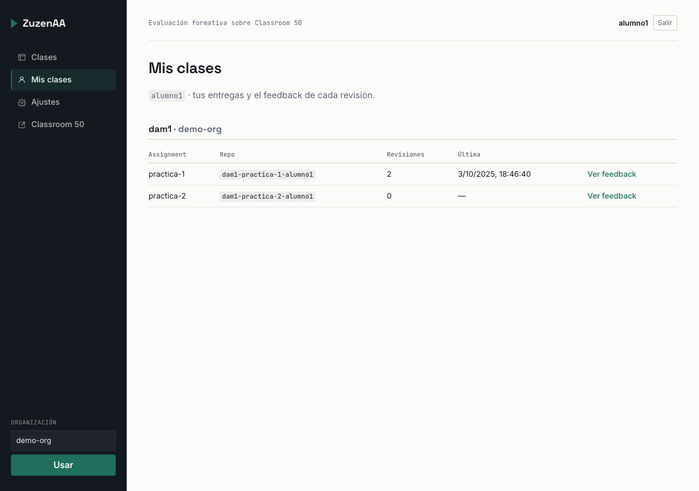
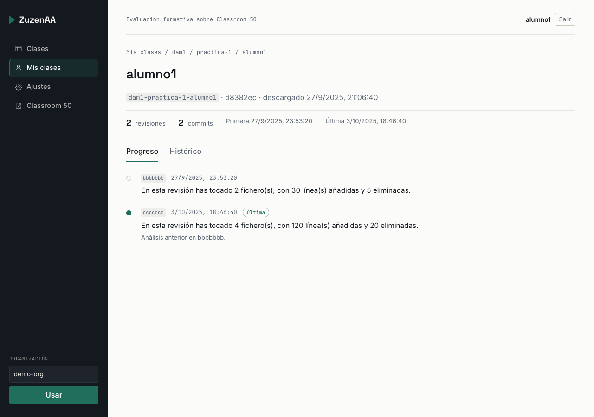
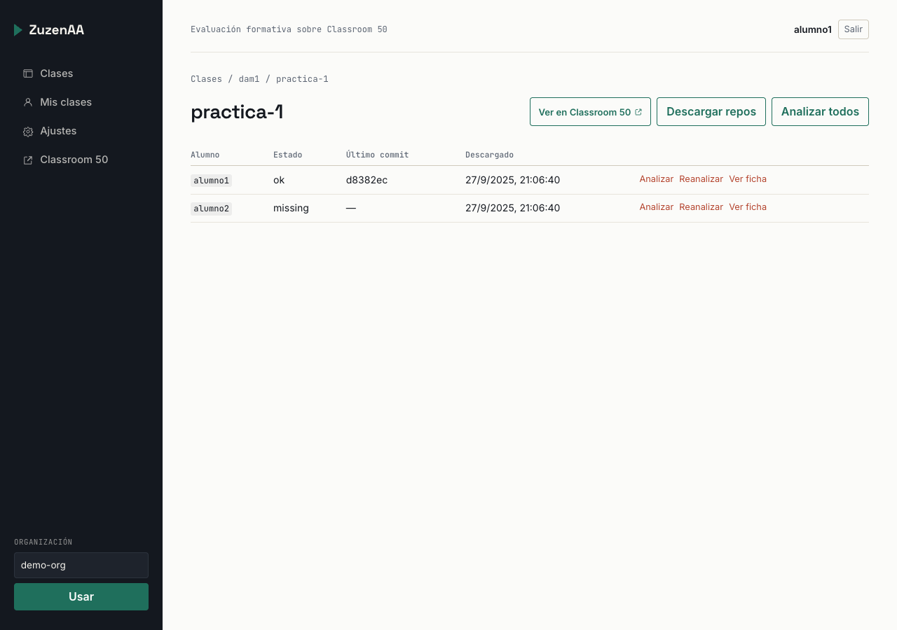

# ZuzenAA

Plataforma de **evaluación formativa agéntica** para ejercicios de programación que se entregan por
GitHub con [Classroom 50](https://github.com/foundation50/classroom50).

[](https://github.com/inigopa-cj/zuzenaa/actions/workflows/ci.yml)


Classroom 50 sigue siendo la **autoridad** de clases, assignments, tests y notas. ZuzenAA
**no lo sustituye**: añade lo que Classroom 50 no hace.

- **Descarga** al servidor los repos de los alumnos de un assignment (clon local).
- **Evalúa** ese código con un **agente** que produce feedback pedagógico.
- Guarda **histórico** de feedback (fecha + commit) y **progreso** por alumno.
- Superficie **profesor** (gestionar análisis) y **alumno** (ver lo suyo), en solo lectura de C50.

> Estado: fases **R0–R2** implementadas (base, agente local + histórico, superficie alumno) con
> proveedor LLM `mock`; las fases R3+ están en `docs/03-flujo-y-fases.md`.

---

## Tabla de contenidos

- [Qué es](#qué-es)
- [Características](#características)
- [Capturas](#capturas)
- [Tecnologías](#tecnologías)
- [Arquitectura](#arquitectura)
- [Estructura del repositorio](#estructura-del-repositorio)
- [Requisitos](#requisitos)
- [Arranque rápido](#arranque-rápido)
- [Comandos (Makefile)](#comandos-makefile)
- [Configuración](#configuración)
- [Cómo se usa](#cómo-se-usa)
- [Calidad y tests](#calidad-y-tests)
- [Documentación](#documentación)
- [Seguridad y privacidad](#seguridad-y-privacidad)
- [Contribuir](#contribuir)
- [Licencia](#licencia)

---

## Qué es

ZuzenAA es un **panel de evaluación formativa** para docencia de programación. Mientras
Classroom 50 reparte assignments, ejecuta tests en GitHub Actions y recoge notas, ZuzenAA se
centra en la **revisión cualitativa**:

1. **Descargar** los repositorios de los alumnos al servidor (clon completo en disco).
2. **Analizar** el código local con un agente que genera feedback estructurado (sin dar la
   solución).
3. **Histórico y progreso**: cada análisis queda registrado con su commit y su fecha, y se puede
   ver la evolución del alumno a lo largo de las entregas.
4. **Memoria del curso**: repos + snapshots archivados en disco, exportables (`analyses.json`).

El feedback **vive solo en esta plataforma**; no se publica en GitHub.

## Características

### Profesorado

- Elige organización → clase → assignment (lectura de Classroom 50).
- **Descarga** los repos del roster del assignment al servidor.
- **Analiza** uno o todos los alumnos y guarda histórico con fecha y commit.
- Ve la **ficha de cada alumno**: cronología de revisiones (progreso) y feedback completo.
- Enlaces directos **«Ver en Classroom 50»** por clase y assignment.

### Alumnado

- Entra con GitHub y ve **Mis clases**: sus entregas ya descargadas/analizadas.
- Consulta **todo su histórico** de feedback y su progreso, en solo lectura.
- Un alumno **solo ve lo suyo** (autorización por sesión).

## Capturas

**Alumnado — Mis clases**



**Ficha de un alumno — progreso e histórico**



**Profesorado — repos de un assignment**



> Capturas con datos de ejemplo.

## Tecnologías

| Capa | Tecnología |
| --- | --- |
| Backend | Python 3.12, [FastAPI](https://fastapi.tiangolo.com/), SQLAlchemy 2 (async), Pydantic v2, `uv` |
| Agente | Worker propio con proveedor LLM intercambiable (por defecto `mock`), guardarraíles, contexto real (árbol + diff) |
| Web | React 19, TypeScript, Vite, TanStack Router + Query, CSS propio |
| Base de datos | PostgreSQL 17 (o SQLite en tests) |
| Integración GitHub | CLI `gh` + extensiones `gh-teacher`/`gh-student` (solo lectura), OAuth App |
| Infra | Docker + Docker Compose, nginx |

## Arquitectura

```
[Usuarios]  Profesor / Alumno
     │
     ▼
[Web React] ──► [Backend FastAPI] ──► [Postgres]        (metadatos, histórico)
                     │      └──────► [Disco /data]      (repos + snapshots)
                     ├──► gh teacher (lectura de Classroom 50)
                     ├──► git clone/fetch (repos de alumnos)
                     └──► Gateway LLM ──► proveedor (mock por defecto)
```

Detalle completo y diagramas en [`docs/01-arquitectura.md`](docs/01-arquitectura.md) y
[`docs/diagramas/`](docs/diagramas/README.md).

## Estructura del repositorio

```
ZuzenAA/
├── backend/               # API FastAPI + agente + adaptador gh (uv)
├── web/                   # SPA React/TS (Vite) + nginx
├── docs/                  # Visión, arquitectura, fases, guías, diagramas
├── docker-compose.yml     # Arranque "producción-local" (web :8080)
├── docker-compose.dev.yml # Modo desarrollo con recarga (web :5173)
├── Makefile               # Atajos de arranque y calidad
├── .env.example           # Plantilla de variables de entorno
└── AGENTS.md              # Contexto para asistentes de código
```

## Requisitos

- **Docker** + **Docker Compose** (todo el proyecto está dockerizado).
- Cuenta de **GitHub** con acceso a la organización del centro.
- Organización en plan **Team o Enterprise** (lo exige Classroom 50; gratis para docentes
  verificados con GitHub Education) y ya preparada en Classroom 50.

Para desarrollo **sin Docker**: `uv` (backend) y Node.js 24 (web); ver
[`backend/README.md`](backend/README.md) y [`web/README.md`](web/README.md).

## Arranque rápido

```sh
cp .env.example .env     # ajusta POSTGRES_PASSWORD y ZUZENAA_SECRET_KEY
make up                  # construye y arranca db + backend + web
```

- Web: <http://localhost:8080>
- API: <http://localhost:8000/health> (y vía web en `/api/health`)

**Para que el login funcione** hay que crear una **OAuth App de GitHub** y poner las credenciales
en `.env`. Guía paso a paso: [`docs/05-guia-configuracion.md`](docs/05-guia-configuracion.md).
Sin OAuth, el atajo de desarrollo `ZUZENAA_ALLOW_ENV_TOKEN=true` permite leer sin identidad de
usuario.

## Comandos (Makefile)

`make help` lista todo. Los principales:

| Comando | Qué hace |
| --- | --- |
| `make up` / `make down` | Arranca / para db + backend + web (web en `:8080`, API en `:8000`). |
| `make dev` / `make dev-down` | Modo desarrollo con recarga en caliente (web en `:5173`). |
| `make logs` / `make ps` | Logs en vivo / estado de los servicios. |
| `make build` | Construye las imágenes. |
| `make test` | Backend: `ruff` + `mypy` + `pytest`. |
| `make test-web` | Web: `oxlint` + build de producción. |
| `make test-all` | Backend + web. |
| `make clean` | Para y borra volúmenes (**se pierden los datos**). |

## Configuración

Toda la configuración vive en `.env` (prefijo `ZUZENAA_`). Lo esencial:

| Variable | Para qué |
| --- | --- |
| `POSTGRES_*` | Credenciales de la base de datos (las usa Docker Compose). |
| `ZUZENAA_SECRET_KEY` | Cifra en reposo el token de GitHub y firma el `state` de OAuth. **Estable y secreta.** |
| `ZUZENAA_BACKEND_URL` / `_FRONTEND_URL` | URLs y callback de OAuth. |
| `ZUZENAA_GITHUB_OAUTH_CLIENT_ID` / `_SECRET` | Credenciales de la OAuth App. |
| `ZUZENAA_CLASSROOM50_URL` | Base de la web de Classroom 50 para los enlaces (por si es self-hosted). |
| `ZUZENAA_LLM_PROVIDER` | Proveedor del agente (`mock` por defecto). |
| `ZUZENAA_AGENT_MAX_DIFF_CHARS` | Límite del diff que recibe el agente. |
| `ZUZENAA_ALLOW_ENV_TOKEN` / `_GITHUB_TOKEN` | Atajo local sin sesión (solo desarrollo). |

Referencia completa y puesta en marcha: [`docs/05-guia-configuracion.md`](docs/05-guia-configuracion.md).

## Cómo se usa

### Profesorado

1. Entra con GitHub (OAuth).
2. Elige la **organización** en el panel lateral.
3. Entra en una **clase** → un **assignment**.
4. Pulsa **Descargar repos** (clona los repos del roster al servidor).
5. Pulsa **Analizar** (un alumno o **Analizar todos**).
6. Abre **Ver ficha** de un alumno para el histórico y el progreso, y edita los análisis con
   **Reanalizar** si es necesario.

### Alumnado

1. Entra con GitHub.
2. Abre **Mis clases**: aparecen las entregas que el profesorado ya descargó/analizó.
3. En **Ver feedback**, consulta la pestaña **Progreso** (cronología) y **Histórico** (feedback
   completo por commit y fecha).

### Casos de uso habituales

- **Revisar una entrega concreta**: clase → assignment → ficha del alumno → último análisis.
- **Evaluar toda la clase**: assignment → **Analizar todos** → revisar fichas una a una.
- **Seguir la evolución de un alumno**: ficha → pestaña **Progreso** (commits ordenados en el
  tiempo).
- **Reanálisis tras un commit nuevo**: **Descargar repos** (actualiza clones) → **Analizar**
  (cachea si no cambió el commit).
- **Saltar a Classroom 50**: enlaces **«Ver en Classroom 50»** por clase y assignment.
- **El alumno ve lo suyo**: **Mis clases** (solo lectura).

## Calidad y tests

```sh
make test       # backend: ruff + mypy + pytest
make test-web   # web: oxlint + build
make test-all   # todo
```

## Documentación

| Doc | Contenido |
| --- | --- |
| [`docs/00-vision-y-alcance.md`](docs/00-vision-y-alcance.md) | Qué es, qué añade, reparto con Classroom 50, alcance. |
| [`docs/01-arquitectura.md`](docs/01-arquitectura.md) | Arquitectura, flujos, seguridad, riesgos. |
| [`docs/02-modelo-datos-y-almacenamiento.md`](docs/02-modelo-datos-y-almacenamiento.md) | Estructura en disco y modelo de datos. |
| [`docs/03-flujo-y-fases.md`](docs/03-flujo-y-fases.md) | Flujo profesor/alumno, fases (R0+) y pendientes. |
| [`docs/04-autenticacion.md`](docs/04-autenticacion.md) | Autenticación GitHub OAuth (detalle). |
| [`docs/05-guia-configuracion.md`](docs/05-guia-configuracion.md) | **Guía paso a paso** de puesta en marcha. |
| [`docs/diagramas/`](docs/diagramas/README.md) | Casos de uso y secuencias. |

## Seguridad y privacidad

- El token de GitHub del usuario se **cifra en reposo** (Fernet derivado de
  `ZUZENAA_SECRET_KEY`) y se resuelve por petición.
- La lectura del feedback está **autorizada**: cada alumno ve solo lo suyo; el profesorado de la
  clase puede ver a cualquiera.
- El **código del alumno** se envía al proveedor LLM a través del gateway del backend; la clave
  nunca está en los repos de alumnos. Proveedor UE/local recomendado (R4/R5).
- Este repositorio **no debe contener** `.env` ni datos de alumnos. Consulta `.gitignore`.

## Contribuir

¿Ideas, dudas o fallos? Abre un issue con la plantilla correspondiente. Antes de enviar cambios
mira [`CONTRIBUTING.md`](CONTRIBUTING.md); para temas de seguridad, [`SECURITY.md`](SECURITY.md).

## Licencia

Este proyecto se distribuye bajo la **GNU General Public License v3.0** (GPL-3.0). Ver
[`LICENSE`](LICENSE).

Classroom 50 también es GPL-3.0; ZuzenAA lo consume como herramienta separada (CLI `gh teacher`),
sin reutilizar su código.

## Créditos

- [Classroom 50](https://github.com/foundation50/classroom50) y la
  [Fifty Foundation](https://fifty.foundation/), sobre cuya base se construye.
- Institución/centro al que pertenece el proyecto (por completar).
