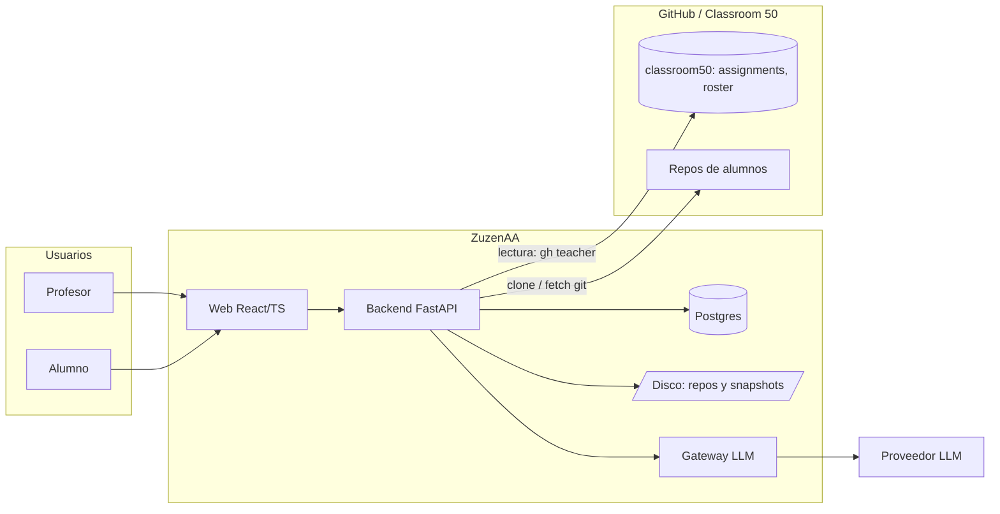
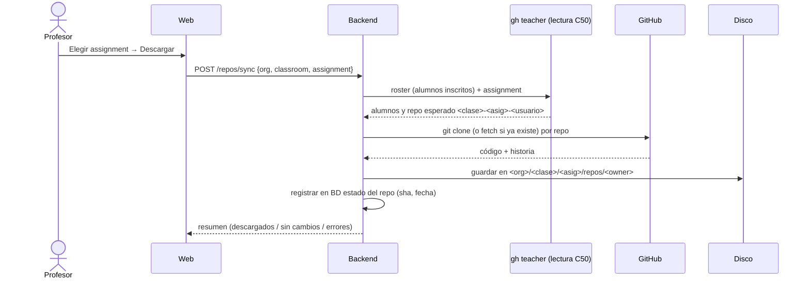

# 01 · Arquitectura

## 1. Vista general



## 2. Componentes

### 2.1 Web (React/TS)

- **Superficie profesor**: elegir org/clase/assignment; **Descargar repos**; **Analizar**; ver
  **histórico** por alumno y **progreso**.
- **Superficie alumno**: sus clases/assignments; por repo, **todo su histórico** de feedback
  (fecha + commit) y progreso.
- Navegación: Clases → Clase → Assignment (Repos / Análisis / Histórico / Progreso) y Ajustes.

### 2.2 Backend (FastAPI)

- **Auth** (GitHub OAuth): sesiones + token cifrado. Igual que el MVP.
- **Lectura de Classroom 50** (solo lectura): `gh teacher classroom/assignment/roster list`.
- **Repo Manager**: clona/actualiza repos de alumnos en disco y crea snapshots.
- **Agente** (worker): lee el código local, llama al LLM, guarda el feedback.
- **Evolución**: compara análisis sucesivos de un alumno.
- **Tutor RAG** (futuro, R5): recuperación sobre el material del curso + generación con el mismo
  gateway LLM y guardarraíles, con citas de las fuentes.
- **Persistencia**: BD (metadatos/estado) + disco (código).

### 2.3 Almacenamiento

- **Disco del servidor** (volumen Docker), estructura por org/clase/assignment/alumno.
- Migrable a MinIO/S3 detrás de una interfaz de almacenamiento.

## 3. Flujos

### 3.1 Descargar repos de un assignment



### 3.2 Analizar con el agente

```mermaid
sequenceDiagram
    actor P as Profesor
    participant W as Web
    participant B as Backend
    participant FS as Disco
    participant GW as Gateway LLM
    participant DB as BD
    P->>W: Analizar (alumno o todos)
    W->>B: POST /analysis {scope}
    B->>FS: leer repo local + diff/snapshot
    B->>DB: ¿hay análisis de este commit? (cache; forzar opcional)
    alt no cacheado o forzar
        B->>GW: contexto + código (diff, evidencias)
        GW-->>B: feedback estructurado (guardarraíles)
        B->>FS: snapshot congelado del commit
        B->>DB: guardar análisis (commit, fecha, feedback, evolución)
    end
    B-->>W: resultado
```

### 3.3 Ver histórico y progreso

- Lista de análisis por alumno/repo, ordenada por fecha, con commit y feedback.
- Progreso: serie temporal a lo largo de los commits/entregas.

## 4. Seguridad y coste

- El token del profesor se **cifra en reposo**; cada petición usa su identidad.
- El **LLM** se llama desde el **gateway del backend**; la clave vive en el servidor, nunca en repos
  de alumnos.
- Análisis **bajo demanda**, **cache por commit** (con forzar reanálisis) y límite de diff para
  controlar el gasto.
- El agente corre como **worker del backend** (0 minutos de GitHub Actions).

## 5. Riesgos

| ID | Riesgo | Mitigación |
| --- | --- | --- |
| R1 | Volumen de disco por repos + snapshots | Retención, snapshots comprimidos, migración a objetos. |
| R2 | Clones lentos/grandes (N alumnos × historia) | Clon superficial/filtrado, colas y progreso. |
| R3 | Coste LLM por análisis | Bajo demanda, cache por commit, presupuesto, límite de diff. |
| R4 | Privacidad: código del alumno a LLM externo | Proveedor UE o local; consentimiento; minimización. |
| R5 | Repo aún no aceptado / renombrado | Ignorar y reportar; reintentar tras aceptación. |
| R6 | Histórico atado a la BD | Exportar `analyses.json`/`feedback.md` junto al código. |
| R7 | Cambios en el CLI de Classroom 50 | Fijar versión; adaptador aislado; tests de contrato. |
