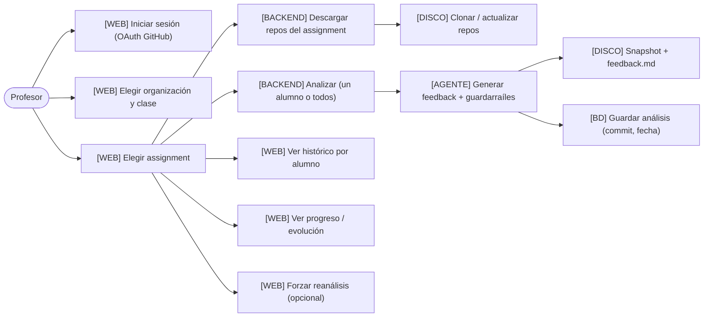
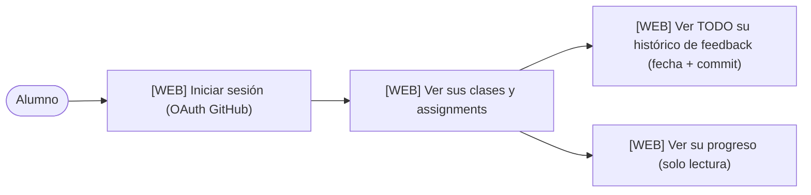
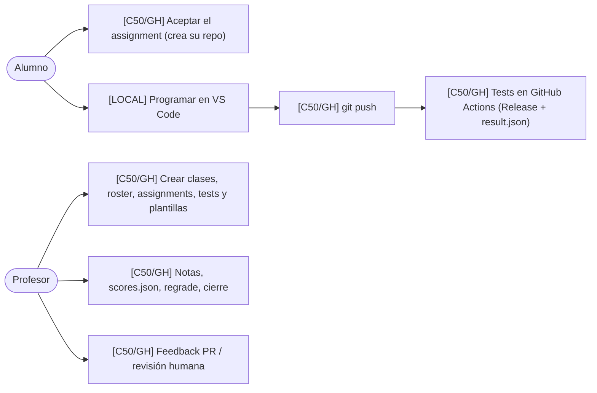

# 01 · Casos de uso

Agrupados por **dónde** ocurre cada acción. `ZuzenAA` = nuestra plataforma; `Classroom 50 / GitHub`
= la autoridad de la entrega, los tests y las notas (no lo tocamos).

## A. Profesor — ZuzenAA

## B. Alumno — ZuzenAA

## C. Profesor y alumno — Classroom 50 / GitHub (fuera de ZuzenAA)

Todo lo demás sigue **en Classroom 50**, no en nuestra plataforma. Se documenta aquí para dejar claro el
reparto.

## Resumen por ubicación

| Ubicación | Naturaleza |
| --- | --- |
| `[WEB]` + `[BACKEND]` | ZuzenAA: elegir, descargar, analizar, histórico, progreso. |
| `[DISCO]` | Repos clonados y snapshots por análisis. |
| `[BD]` | Usuario/sesión/token y los análisis (histórico). |
| `[C50/GH]` | Clases, roster, assignments, tests, entrega, notas y feedback humano. |
| `[LOCAL]` | El alumno programa en VS Code y hace push. |
