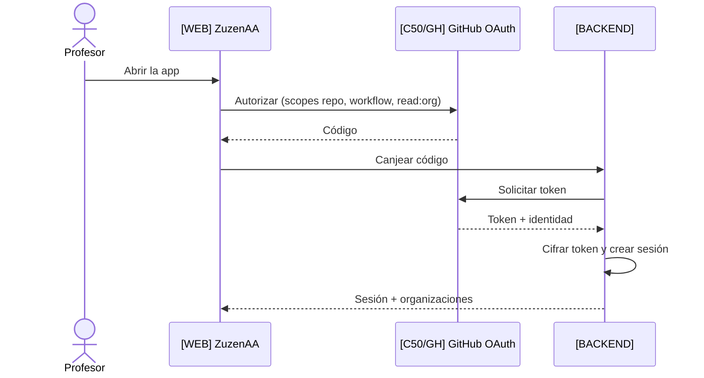
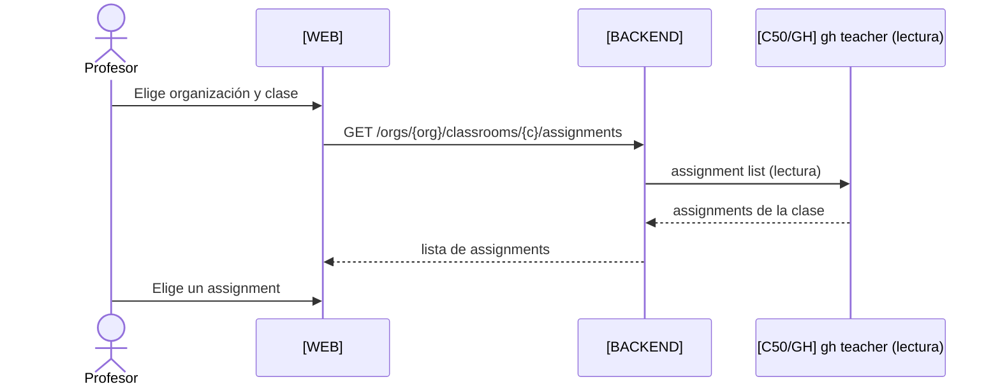
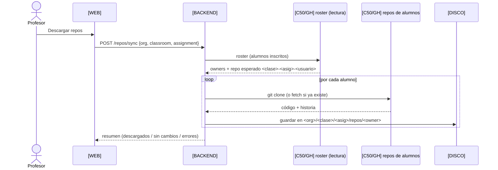
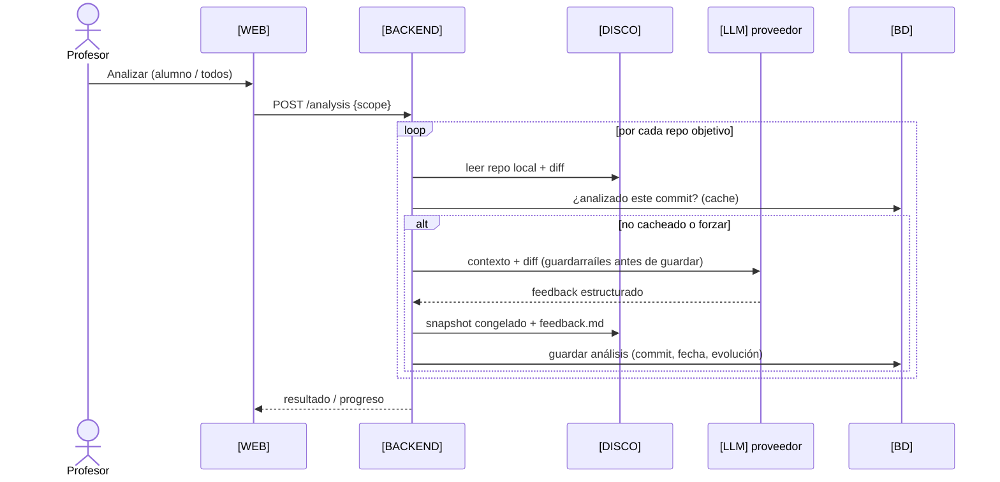
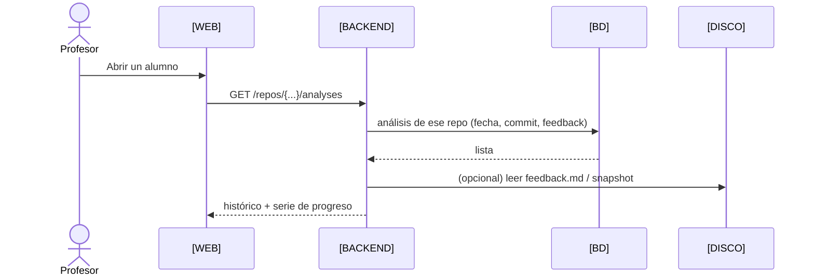

# 02 · Secuencias — Profesor

`[C50/GH]` = lo que hace Classroom 50 / GitHub (fuera de ZuzenAA).

## 2.1 Login

## 2.2 Elegir clase y assignment (solo lectura de Classroom 50)

## 2.3 Descargar repos del assignment

## 2.4 Analizar (uno o todos)

## 2.5 Histórico y progreso

