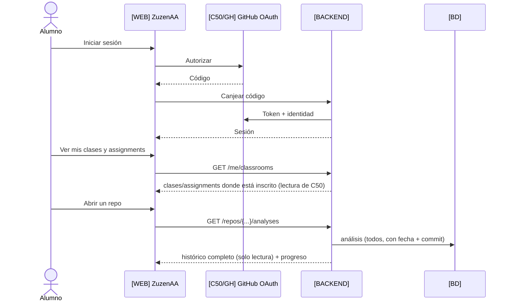

# 03 · Secuencias — Alumno

## 3.1 Login y ver su histórico (ZuzenAA)



## 3.2 La entrega sigue ocurriendo en Classroom 50 / GitHub

Lo que el alumno hace **fuera** de ZuzenAA (se documenta para dejar claro el reparto).

```mermaid
sequenceDiagram
  actor A as Alumno
  participant C as [C50/GH] gh student / GitHub
  participant ACT as [C50/GH] GitHub Actions
  A->>C: gh student accept (crea su repo)
  A->>A: [LOCAL] Programa en VS Code
  A->>C: git push (o gh student submit)
  C->>ACT: Tests configurados por el profesor
  ACT->>C: Release + result.json; nota en scores.json
  Note over A,C: Esto no lo hace ZuzenAA: es Classroom 50.
```
