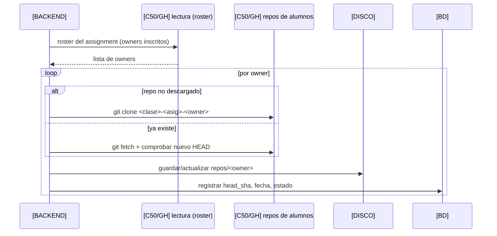
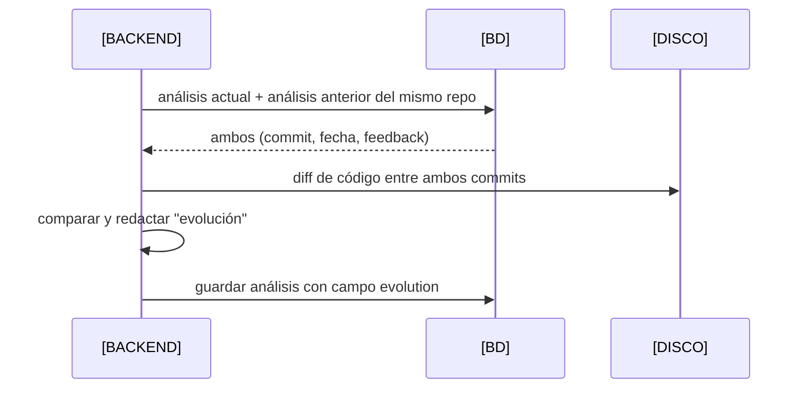

# 04 · Secuencias — Sistema (Repo Manager, agente, evolución)

## 4.1 Repo Manager: clonar y actualizar



## 4.2 Agente: análisis local y guardarraíles

```mermaid
sequenceDiagram
  participant B as [BACKEND]
  participant FS as [DISCO]
  participant LLM as [LLM]
  participant DB as [BD]
  B->>FS: leer repos/<owner> en el commit objetivo
  B->>B: construir contexto (diff, evidencias)
  B->>LLM: prompt + contexto
  LLM-->>B: salida estructurada
  B->>B: validar esquema + guardarraíles (sin código/solución)
  alt cumple
    B->>FS: snapshot + feedback.md
    B->>DB: guardar análisis
  else viola
    B->>B: bloquea/regenera; registra el motivo
  end
```

## 4.3 Evolución entre análisis




## Resumen de ubicaciones

| Acción | Ubicación |
| --- | --- |
| Clonar/actualizar repos | `[BACKEND]` → `[DISCO]` |
| Analizar con agente | `[BACKEND]` + `[LLM]` → `[BD]`/`[DISCO]` |
| Guardar histórico y evolución | `[BD]` (+ `feedback.md` en `[DISCO]`) |
| Tests, entrega y notas | `[C50/GH]` (fuera de ZuzenAA) |
